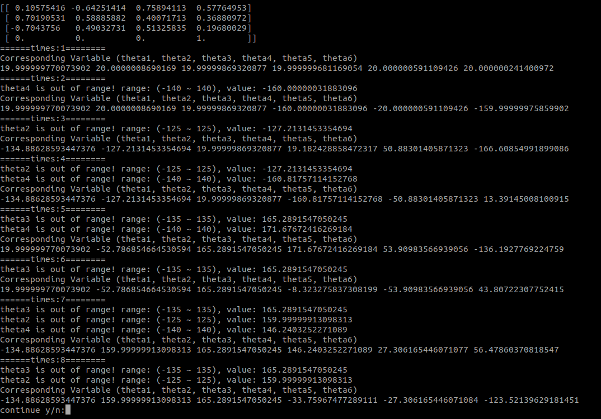

# 312512063_張祐維 robotics_project1
## How to run
Use ubuntu open terminal and enter the following commands... \
Make sure your ubuntu has python3.8 above.
```
source environment.sh
python3 main.py
```
source environment.sh to install numpy.
## Running the code
first you'll see... \
 \
Enter "y" or "n" to chose auto input or not.
### Question1
copy the following string for forward kinematric input(if your not auto input):
```
20 20 20 20 20 20
20 -53.687 165.1699 171.566 52.9026 -136.0080
```
 \
then the output should be... \
 \
or \

### Question2
copy the following string for inverse kinematric input(Cartesian matrix) (if your not auto input)
```
0.10575416,-0.64251414,0.75894113,0.57764953/0.70190531,0.58885882,0.40071713,0.36880972/-0.7043756,0.49032731,0.51325835,0.19680029/0.,0.,0.,1.
```
copy the following string for inverse kinematric input(Cartesian matrix) \
 \
then the output should be... \


## Program Architecture Explanation
### Program Flow
The program flow revolves around the classes defined in robot_model.py. \
Specifically, the Joint class encapsulates the parameters of a robotic joint, such as the Denavit-Hartenberg (DH) parameters and the joint angle range. \
The puma560 class, representing the PUMA 560 robot, initializes six instances of the Joint class to model its joints. \
The crucial aspect of the program's flow is the calculation of forward and inverse kinematics.

### Core Code Explanation
#### Forward Kinematics
The kinematics method in the Joint class computes the Denavit-Hartenberg (DH) transformation matrix for the corresponding joint. \
It uses trigonometric functions (cosine and sine) to calculate the elements of the transformation matrix based on the joint parameters (theta, alpha, a, and d). \
The resulting transformation matrix represents the position and orientation of the joint in the robot's coordinate system.

#### Inverse Kinematics
The dh_inverse_kinematics method in the puma560 class implements an inverse kinematics solution. \
It takes a desired end-effector pose in the form of a 4x4 homogeneous transformation matrix (matrix). \
The method iteratively explores possible joint angles for the robot to reach the specified pose. \
This process involves solving trigonometric equations and considering multiple solutions due to the nature of trigonometric functions. \
The calculated joint angles are then printed as a result.

## Program running process


## Mathematical operations instructions
### Forward kinematric
every times joint's theta got change it'll run Joint::kinamatics() \
then the joint will update his transform matrix with the follolwing image. \
 
### Inverse kinematric
when input by Cartesian matrix we need to get each joint's theta. \
it'll run puma560::dh_inverse_kinematics() \
then the thetas' equation need to be pre-program with the following equations \
 \
 
