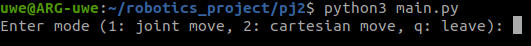
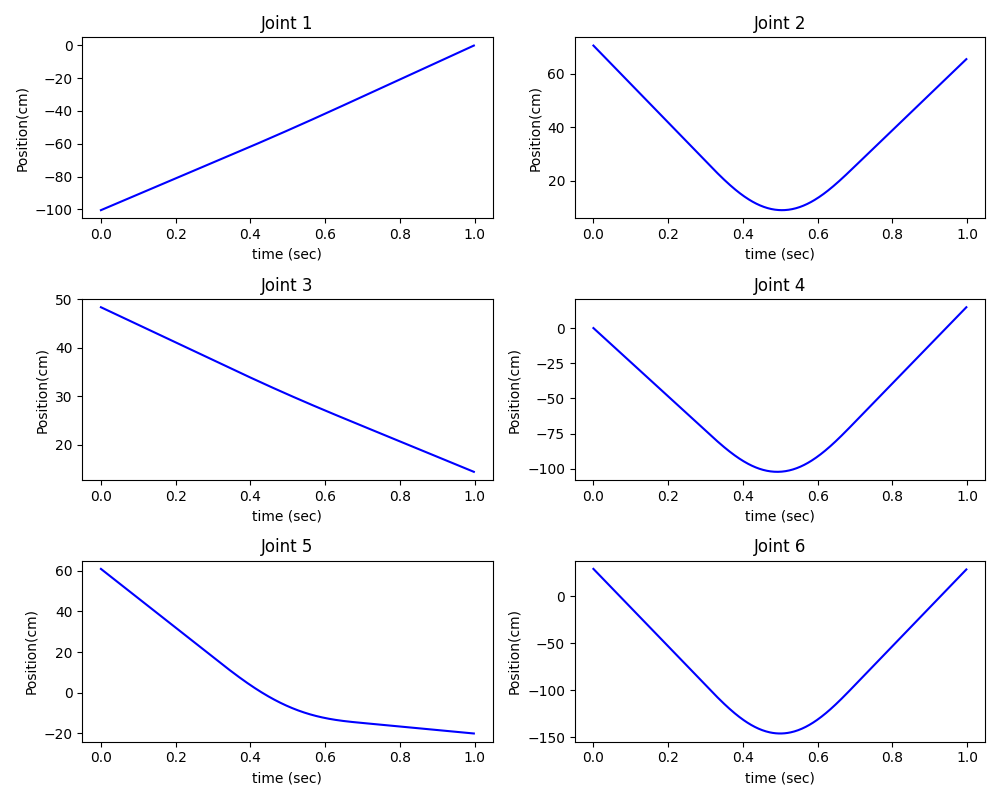
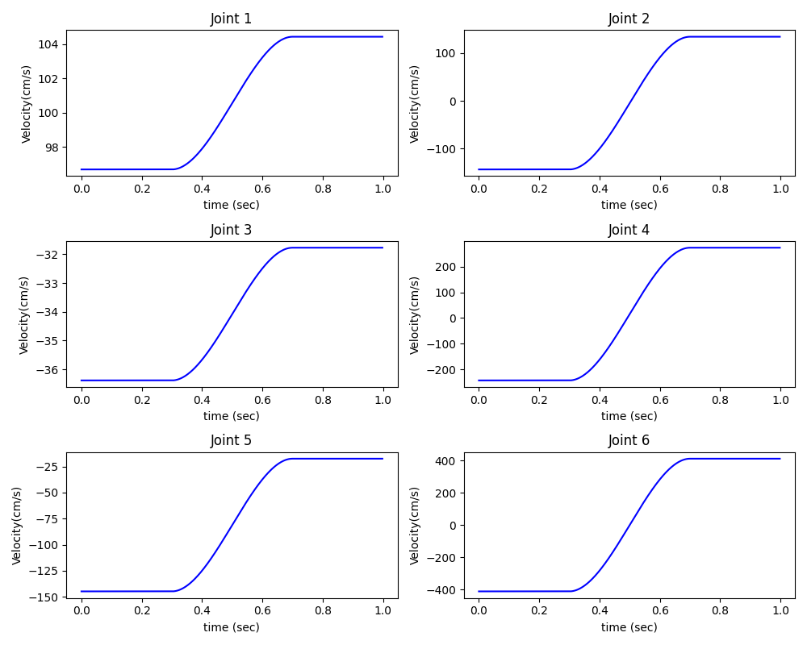
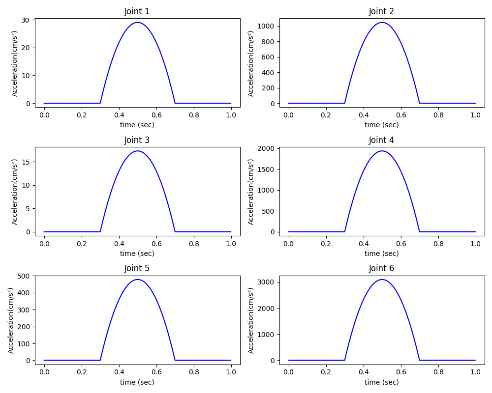
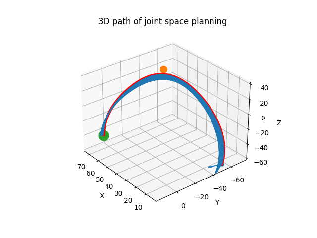
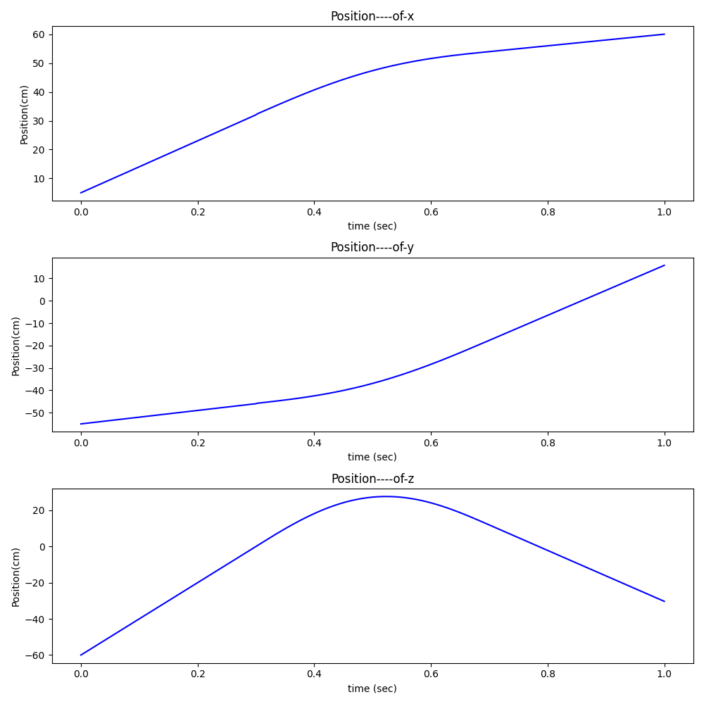
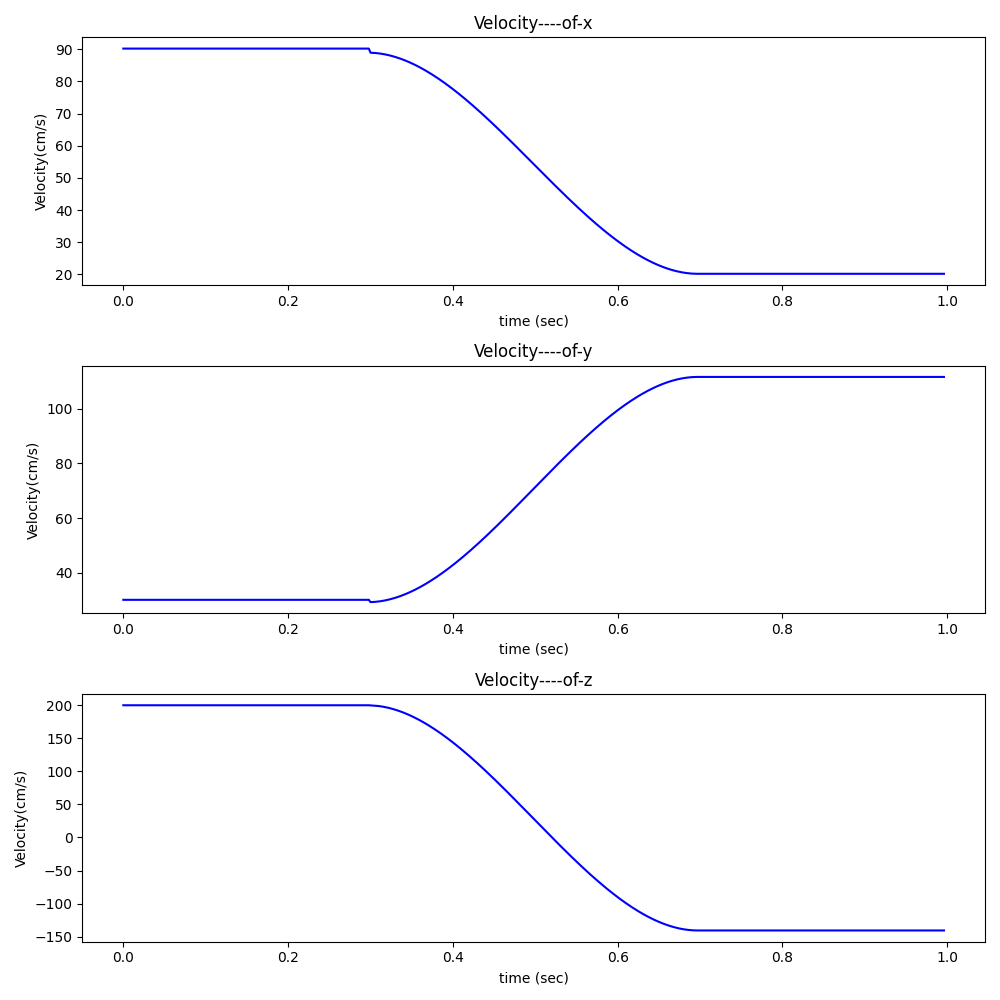
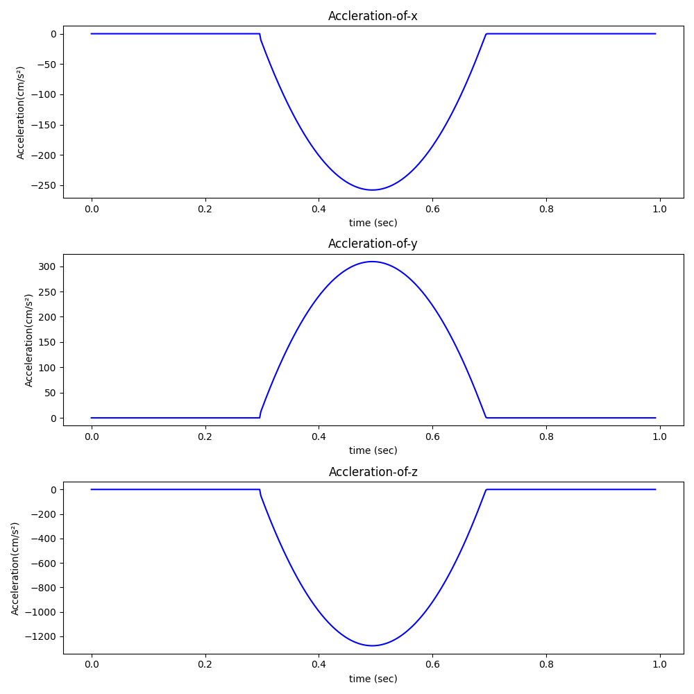
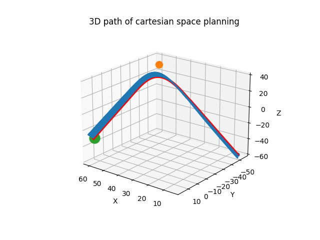

# Robotics_Project2_312512063_張祐維
## 介面說明
Use ubuntu open terminal and enter the following commands... \
Make sure your ubuntu has python3.8 above.
source environment.sh to install numpy.
```
source environment.sh
python3 main.py
```

First you'll see... \
 \
Enter "1" or "2" to chose joint or cartesian move.

## 程式架構說明
### Joint move
1. Initialization:
The function starts by creating a puma560 object and initializing arrays to store joint positions (P1, P2, P3), velocities (L1, L2), and other trajectory parameters.

2. Trajectory Calculation:
It divides the movement into segments (like from A to A', A' to B, and B to C) and calculates the joint positions, speeds, and accelerations for each segment based on linear interpolation.
The time t is divided into intervals, and for each interval, the appropriate trajectory segment is calculated.

3. Transformation and Visualization:
For each time step, the joint positions are transformed into Cartesian coordinates using the trans_pos function.
These positions and orientations are then used to plot the joint movements in both joint space (angles) and Cartesian space (3D path).

### Cartesian move

1. Trajectory Calculation Between Points:
It starts by computing the transitions between points A, B, and C using the from_2_end function. This function computes the necessary changes in position and orientation (in terms of x, y, z, psi, theta, and phi) to move from one point to another.
Linear and Transitional Trajectories:

2. Linear Trajectory (A to A' and B' to C): 
The linear_trajectory function is used to compute the linear parts of the trajectory (from A to A' and from B' to C). It handles the straightforward movement between these points.
Transitional Trajectory (A' to B'): The trans_trajectory function is then employed for the transitional phase between A' and B'. This is a more complex calculation that accounts for the smooth transition in the middle of the path, handling the changes in velocity and acceleration.

3. Combining Trajectories:
The trajectories computed for each segment (A to A', A' to B', B' to C) are concatenated to form a complete path from A to C. This involves merging the positional data and the orientation data calculated for each segment.

4. Visualization:
The function visualizes the entire trajectory in Cartesian space. It plots the 3D path, showing how the position of the robot's end-effector changes over time.
It also plots the velocity and acceleration profiles for the movement, providing insights into the dynamics of the trajectory.

5. Orientation Handling:
Special attention is given to the orientation (Euler angles: psi, theta, phi) to ensure a smooth rotational transition during the movement.

## Joint Move Result

Joint angular

Joint angular speed
 
Joint angular acceleration




## Caresian Move Result
Caresian position

Caresian speed
 
Caresian acceleration




## 討論兩種軌跡規劃的優缺點、遇到奇異點如何處理
### Advantages and Disadvantages:
Joint Space Planning: Easier to compute as it deals directly with the robot's actuators. However, it can be less intuitive for tasks requiring specific spatial paths.
Cartesian Space Planning: More intuitive for tasks that are defined in Cartesian coordinates, like drawing or assembly tasks. The computation can be more complex due to the need for inverse kinematics.

### Handling Singularities:
Singularities occur when the robot's configuration leads to a loss of degrees of freedom. They are more common in Cartesian planning due to inverse kinematics.
To handle singularities, methods such as damped least squares (for inverse kinematics) or trajectory adjustment to avoid known singular configurations can be used. Advanced algorithms may also implement redundancy resolution strategies.